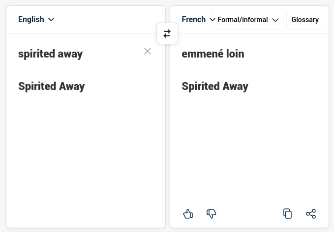
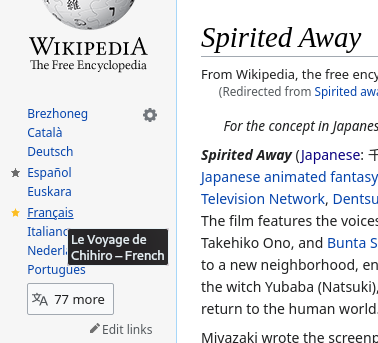

# wikitrad

:: fr

Parfois, un nom propre, un terme technique échappe aux algorithmes de [Google Traduction](https://translate.google.com) ou [DeepL](https://deepl.com).

J'ai trouvé un autre moyen de traduires ces termes: Wikipédia: des millions d'articles dans des centaines de langues, avec un lien pour changer celle-ci sur chaque page.

J'ai donc créer ce petit outil pour automatiser la tâche: chercher un article dans la langue source, récupérer le lien vers ce même article dans la langue cible, et enfin récupérer le titre du nouvel article.

Il utilise aussi [langdetect](https://pypi.org/project/langdetect) pour détecter la langue source, si celle-ci n'est pas explicitement donnée.

[Code source](https://github.com/ewen-lbh/wikitrad)

:: en

Sometimes, a proper noun or a technical term fails to be translated using [Google Translate](https://translate.google.com) or [DeepL](https://deepl.com).

I found another way to translate those terms: Wikipedia, which has millions of articles in hundreds of languages, all with links to read the page in another language.

I therefore created this little command-line program to automate the task: look for a page in the source language, get the link to the target language's article, get that article's title.

I also used [langdetect](https://pypi.org/project/langdetect) to determine the source language, in case it isn't provided by the user.

[Source code](https://github.com/ewen-lbh/wikitrad)
